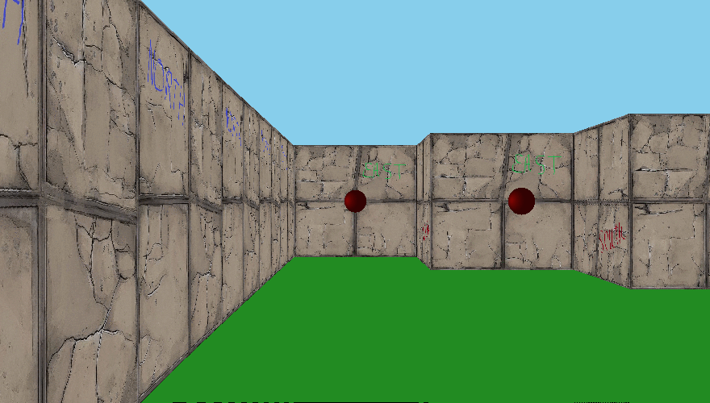

# Cub3D

Один из учебных проектов школы 21, отдающий дань уважаения игре 90-х Wolfenstein 3D.

Цель проекта - создать «реалистичную» трехмерную графику с использованием принципов Ray-Casting.

Разрешенные фукнции:
  - open, close, read, write, malloc, free, perror, strerror, exit;
  - All functions of the math library;
  - All functions of the MinilibX.

# Запуск программы (Linux)
	
	Сборка исполняемого файла осуществляется с помощью makefile
	
	Запуск программы:
	./cub3d map.cub
	
	Сохрание скриншота:
	./cub3d map.cub --save

# Управление

За изменение координат игрока отвечают клавиши: ``W`` ``A`` ``S`` ``D``

Вращение игрока вокруг оси: ``←`` ``→``

Выход из программы клавиша ``ESC`` или нажатие на крестик

# Формат карты (файл .cub)

	R <число> <число> (разрешение экрана)
	NO <путь> (путь до текстуры северной части стены)
	SO <путь> (путь до текстуры южной части стены)
	EA <путь> (путь до текстуры восточной части стены)
	WE <путь> (путь до текстуры западной части стены)
	S <путь> (путь до текстуры спрайта)
	С <число>,<число>,<число> (цвет пола в формате RBG)
	F <число>,<число>,<число> (цвет потолка в формате RBG)

	1111111
	1000001
	10000N1
	1111111 (карта, где 1 - стена, 0 - пустое пространство, N/E/W/S - местоположение игрока и направление взгляда)
	

